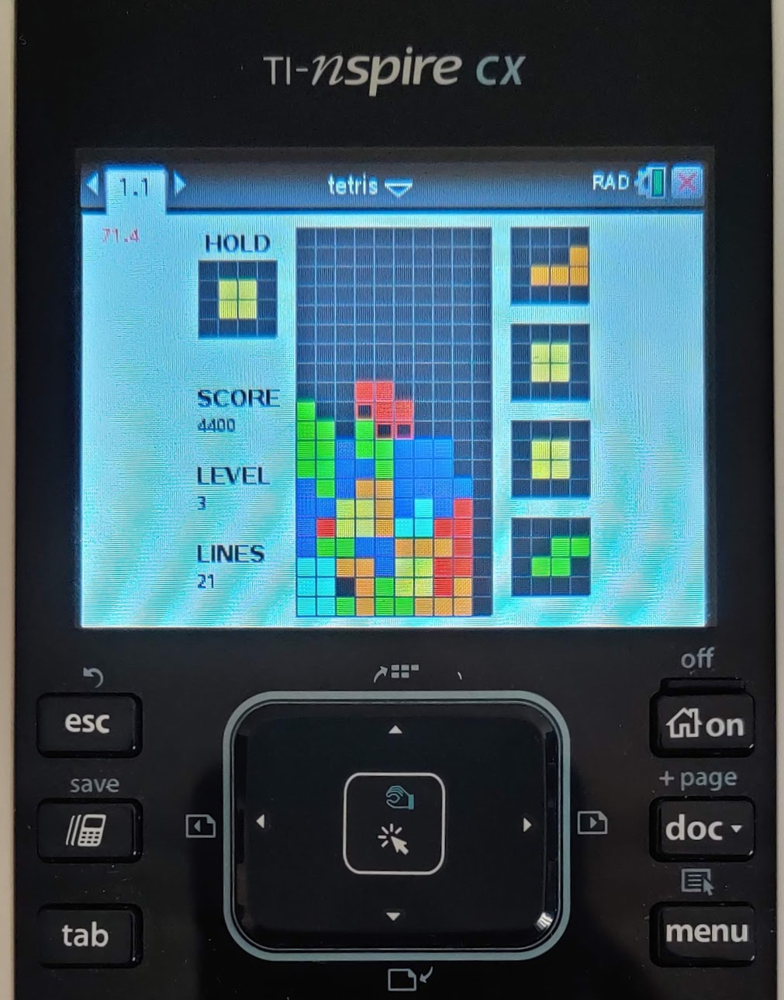

# Tetris
A full clone of modern Tetris for the TI-Nspire written in lua as to run on any calculator regardless of whether its jailbroken.
Supports both the official TI Student Software and the [Luna](https://github.com/ndless-nspire/Luna) compiler. 

The [Tetris Guideline](https://tetris.fandom.com/wiki/Tetris_Guideline) is the official specification which all Tetris products should follow.
This project implements this specification faithfully including:
 - Toggleable Ghost pieces
- Accurate piece starting locations
- The Standard Rotation System with accurate wall kicks and all T-spins
- 7-bag randomization
- Drop speed implemented as in Tetris.com Tetris
- Piece lock delay to allow sliding at higher game speeds
- Accurate scoring including T-spin recognition and back-to-back rewards
- Start and pause delay countdown

## Running on the TI-Nspire CX



## Building

Build source into a single .lua file using [TI-Resource-Merge](https://github.com/DaveDuck321/TI-Resource-Merge)

```
$ python NspireMerger.py
```

The file `out.lua` will be created. Either copy and paste the contents into the TI-Student Software or compile via luna:
```
$ ./luna out.lua out.tns
```
